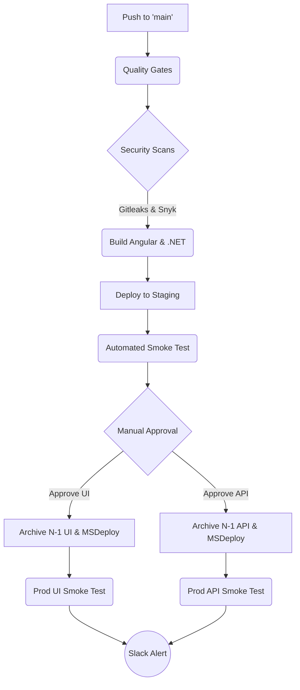

# 🚀 Enterprise Bitbucket CI/CD — Angular + .NET on IIS


A production-grade, DevSecOps-integrated CI/CD pipeline for deploying an **Angular frontend** and **.NET 8 API** to **IIS on a Windows EC2 instance**. This repository demonstrates Senior DevOps engineering patterns, including zero-downtime deployments, automated rollbacks, and rigorous security gates.

---

## 🌟 Enterprise Features Implemented

*   **DevSecOps Pipeline:** Integrated `gitleaks` (secret scanning) and `Snyk` (dependency vulnerability scanning).
*   **Zero-Downtime UI Deployments:** MSDeploy differential sync with content hashing ensures users never experience broken assets during deployments.
*   **Automated Smoke Testing:** Post-deployment HTTP health checks with automated retries and timeouts.
*   **Instant Rollback Mechanism:** Pipeline automatically archives the `N-1` state. Included custom pipelines (`rollback-ui`, `rollback-api`) to restore the previous release in seconds.
*   **Environment Promotion:** Multi-stage promotion (`develop` -> Staging -> `main` -> Production) with manual approval gates for production.
*   **Secure Authentication:** Uses Native SSH Key Authentication (no password-based SSH).
*   **Rich Observability:** Automated Slack notifications for deployment success, failure, and rollback events.
*   **DRY YAML Architecture:** Heavily utilizes YAML anchors (`&` and `*`) to maintain a clean, reusable pipeline definition.
*   **Dual OS Support:** Includes configuration for both **Windows/IIS (PowerShell + MSDeploy)** and **Linux/Nginx (Bash + rsync)** infrastructure targets.

---

## 🏗️ Architecture Overview



---

## 🛠️ Prerequisites & Setup

### 1. On the EC2 Windows Server
1. **IIS** installed and configured.
2. **Web Deploy 3.5+** installed with the **Complete** option.
3. **OpenSSH Server** installed and running.
4. **`C:\temp` and `C:\releases`** directories created.
5. **SSH Key Setup:** Add the Bitbucket pipeline's public SSH key to the server's `C:\Users\<user>\.ssh\authorized_keys`.

### 2. Bitbucket Repository Settings
Configure the following in **Repository settings > Repository variables**:

| Variable | Description | Security |
| :--- | :--- | :--- |
| `PROD_REMOTE_USERNAME` | Windows server SSH username | Standard |
| `PROD_REMOTE_SERVER_IP` | EC2 IP Address | Standard |
| `PROD_IIS_UI_PHYSICAL_PATH` | e.g. `C:\inetpub\wwwroot\ui` | Standard |
| `PROD_IIS_API_PHYSICAL_PATH`| e.g. `C:\inetpub\wwwroot\api` | Standard |
| `PROD_IIS_APP_POOL_NAME` | IIS App Pool name for the API | Standard |
| `PROD_HEALTH_CHECK_URL` | API health endpoint for smoke tests | Standard |
| `SLACK_WEBHOOK_URL` | Webhook for deployment alerts | **Secured** |
| `SNYK_TOKEN` | Snyk API token for dependency scanning | **Secured** |

*(Note: Duplicate the `PROD_` variables with a `STG_` prefix for the staging environment).*

---

## 🛡️ Files Protected During Sync

The pipeline utilizes MSDeploy's `-skip` rules to ensure server-specific configurations are never overwritten by the build artifact:

*   `web.config` (IIS URL Rewrite rules)
*   `appsettings.json` and `appsettings.*.json` (.NET environment variables)
*   `assets/configuration/appsetting.json` (Angular runtime configurations)

---

## ⏪ Rollback Strategy

Mistakes happen. This pipeline is built for high availability. 

Before every deployment, the server executes a PowerShell command to back up the current physical path to `C:\releases\ui\<timestamp>`. 

If a production smoke test fails, you can instantly recover:
1. Go to Bitbucket Pipelines.
2. Select **Run Pipeline** -> **Custom** -> `rollback-ui-production` (or API).
3. The server instantly drops the broken deployment and restores the `N-1` backup.

---

## 📁 Repository Structure

```text
├── bitbucket-pipelines.yml         # Main CI/CD definition (Windows/IIS)
├── bitbucket-pipelines-linux.yml   # Alternative CI/CD definition (Linux/Nginx)
├── CHANGELOG.md                    # Semantic versioning history
├── SECURITY.md                     # DevSecOps disclosure policies
├── docs/
│   └── runbook.md                  # Operational deployment guides
├── scripts/
│   ├── windows/                    # Windows/IIS (PowerShell) scripts
│   │   ├── deploy_ui.ps1
│   │   ├── deploy_api.ps1
│   │   ├── rollback_ui.ps1
│   │   └── rollback_api.ps1
│   └── linux/                      # Linux/Nginx (Bash) scripts
│       ├── deploy_ui.sh
│       ├── deploy_api.sh
│       ├── rollback_ui.sh
│       └── rollback_api.sh
└── tests/
    └── smoke-test.sh               # Resilient HTTP health checker
```

---

## 📚 Further Reading
*   Review [docs/runbook.md](docs/runbook.md) for incident response protocols.
*   Review [SECURITY.md](SECURITY.md) for our vulnerability handling process.
