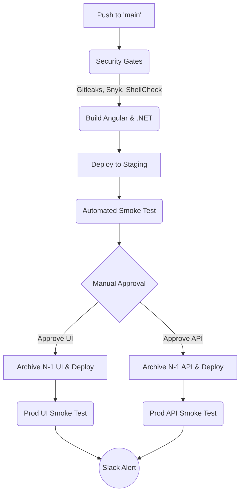

# 🚀 Enterprise Bitbucket CI/CD — Angular + .NET on IIS


A production-grade, DevSecOps-integrated CI/CD pipeline for deploying an **Angular frontend** and **.NET 8 API** to **IIS on a Windows EC2 instance** (or **Nginx on Linux**). This repository demonstrates Senior DevOps engineering patterns, including zero-downtime deployments, automated rollbacks, and rigorous security gates.

---

## 🌟 Enterprise Features Implemented

*   **DevSecOps Pipeline:** Integrated `gitleaks` (secret scanning), `Snyk` (dependency vulnerability scanning), and `shellcheck` (script linting) as parallel security gates.
*   **Zero-Downtime UI Deployments:** Differential sync via rsync (Linux) or content-hashed deployment (Windows) ensures users never experience broken assets.
*   **Automated Smoke Testing:** Post-deployment HTTP health checks with configurable retries and timeouts, integrated into every deployment step.
*   **Instant Rollback Mechanism:** Pipeline automatically archives the `N-1` state. Custom pipelines (`rollback-ui`, `rollback-api`) restore the previous release in seconds.
*   **Environment Promotion:** Multi-stage promotion (`develop` → Staging → `main` → Production) with manual approval gates for production.
*   **Secure Authentication:** Native SSH Key Authentication (no password-based SSH).
*   **Rich Observability:** Automated Slack notifications for deployment success, failure, and rollback events via `after-script` hooks.
*   **DRY YAML Architecture:** Heavily utilizes YAML anchors (`&` and `*`) to maintain a clean, reusable pipeline definition.
*   **Dual OS Support:** Full configurations for both **Windows/IIS (PowerShell + MSDeploy)** and **Linux/Nginx (Bash + rsync)** infrastructure targets.
*   **Database Deployments:** DACPAC-based SQL Server schema management with dry-run script generation and parallel multi-database deployment (Windows pipeline).

---

## 🏗️ Architecture Overview



---

## 🛠️ Prerequisites & Setup

### 1. On the EC2 Windows Server
1. **IIS** installed and configured.
2. **Web Deploy 3.5+** installed with the **Complete** option.
3. **OpenSSH Server** installed and running.
4. **`C:\temp` and `C:\releases`** directories created.
5. **SSH Key Setup:** Add the Bitbucket pipeline's public SSH key to the server's `C:\Users\<user>\.ssh\authorized_keys`.

### 2. On the Linux Server (Alternative)
1. **Nginx** installed and configured.
2. **OpenSSH Server** installed and running.
3. **`/var/backups/edge_ui` and `/var/backups/edge_api`** directories created.
4. **systemd** service configured for the .NET API.
5. **SSH Key Setup:** Add the Bitbucket pipeline's public SSH key to `~/.ssh/authorized_keys`.

### 3. Bitbucket Repository Settings
Configure the following in **Repository settings > Repository variables**:

| Variable | Description | Security |
| :--- | :--- | :--- |
| `PROD_REMOTE_USERNAME` | Windows server SSH username | Standard |
| `PROD_REMOTE_SERVER_IP` | EC2 IP Address | Standard |
| `PROD_IIS_UI_PHYSICAL_PATH` | e.g. `C:\inetpub\wwwroot\ui` | Standard |
| `PROD_IIS_API_PHYSICAL_PATH`| e.g. `C:\inetpub\wwwroot\api` | Standard |
| `PROD_IIS_APP_POOL_NAME` | IIS App Pool name for the API | Standard |
| `PROD_HEALTH_CHECK_URL` | API health endpoint for smoke tests | Standard |
| `SLACK_WEBHOOK_URL` | Webhook for deployment alerts | **Secured** |
| `SNYK_TOKEN` | Snyk API token for dependency scanning | **Secured** |

*(Duplicate the `PROD_` variables with a `STG_` prefix for the staging environment. For Linux, use `PROD_LINUX_` and `STG_LINUX_` prefixed variables.)*

---

## 🛡️ Files Protected During Sync

The pipeline utilizes skip/exclude rules to ensure server-specific configurations are never overwritten by the build artifact:

*   `web.config` (IIS URL Rewrite rules)
*   `appsettings.json` and `appsettings.*.json` (.NET environment variables)
*   `assets/configuration/appsetting.json` (Angular runtime configurations)

---

## ⏪ Rollback Strategy

Mistakes happen. This pipeline is built for high availability. 

Before every deployment, the server executes a backup of the current physical path to `C:\releases\ui\<timestamp>` (Windows) or `/var/backups/edge_ui/<timestamp>` (Linux). Old backups are automatically pruned (keeps last 3).

If a production smoke test fails, you can instantly recover:
1. Go to Bitbucket Pipelines.
2. Select **Run Pipeline** -> **Custom** -> `rollback-ui-production` (or `rollback-api-production`).
3. The server instantly drops the broken deployment and restores the `N-1` backup.

---

## 📁 Repository Structure

```text
├── bitbucket-pipelines.yml         # Root pipeline (copy of windows/ by default)
├── windows/                        # Full Stack Windows Architecture
│   ├── bitbucket-pipelines.yml     # CI/CD: UI + API + DB (DACPAC)
│   └── scripts/                    # PowerShell deployment & rollback scripts
│       ├── deploy_ui.ps1
│       ├── deploy_api.ps1
│       ├── rollback_ui.ps1
│       └── rollback_api.ps1
├── linux/                          # Full Stack Linux Architecture
│   ├── bitbucket-pipelines.yml     # CI/CD: UI + API (Nginx & systemd)
│   └── scripts/                    # Bash deployment & rollback scripts
│       ├── deploy_ui.sh
│       ├── deploy_api.sh
│       ├── rollback_ui.sh
│       └── rollback_api.sh
├── tests/
│   └── smoke-test.sh               # Resilient HTTP health checker
├── docs/
│   ├── runbook.md                  # Operational deployment guides
│   └── db_pipeline_audit.md        # Database deployment architecture breakdown
├── CHANGELOG.md                    # Semantic versioning history
├── CONTRIBUTING.md                 # Contribution guidelines & branching strategy
├── LICENSE                         # MIT License
└── SECURITY.md                     # DevSecOps disclosure policies
```

---

## 📚 Further Reading
*   Review [docs/runbook.md](docs/runbook.md) for incident response protocols.
*   Review [docs/db_pipeline_audit.md](docs/db_pipeline_audit.md) for the DACPAC database deployment architecture.
*   Review [SECURITY.md](SECURITY.md) for our vulnerability handling process.
*   Review [CONTRIBUTING.md](CONTRIBUTING.md) for contribution guidelines.
