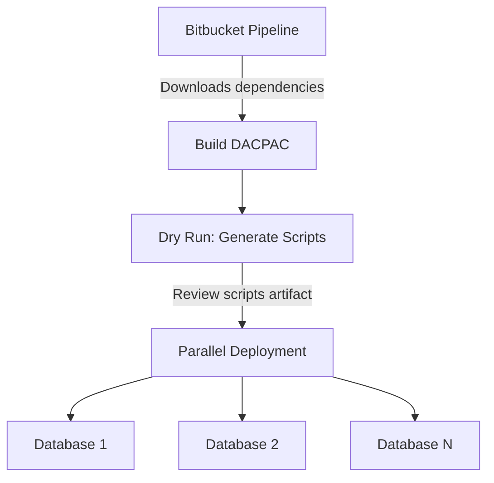

# Database Pipeline Audit (DACPAC)

## Overview
This document outlines the DACPAC database deployment architecture utilized in the Windows pipeline for SQL Server schema management. The pipeline automates the extraction, verification, and deployment of database schema changes to multiple target databases in a reliable and reproducible manner.

## Dry-Run and Script Generation
Before applying changes, the pipeline runs a "Dry Run" step using `sqlpackage` with the `--action:Script` flag.
- **How it works:** It connects to the target server, retrieves a list of applicable databases (e.g., those matching `%sso_docs%`), and generates a T-SQL migration script for each database based on the DACPAC file.
- **Safety properties:** This step generates SQL scripts without making any modifications to the databases. These scripts are saved as artifacts (`sql_scripts/**`), allowing engineers or DBAs to review the planned changes before applying them.

## Parallel Deployment
The deployment step pushes schema changes to multiple databases concurrently.
- **How it works:** The pipeline uses a bash script that iterates through the retrieved database list. It triggers `sqlpackage --action:Publish` for each database in the background (`&`), storing the PIDs and waiting for all to finish using `wait`.
- **Logging:** Success and error logs are maintained (`/tmp/success.log`, `/tmp/failed.log`). If any database fails deployment, the pipeline exits with an error and logs the failure details.

## Architecture Diagram

## Risk Mitigation
The pipeline enforces strict rules during deployment using `sqlpackage` properties to mitigate risk:
- **`BlockOnPossibleDataLoss=True`**: Prevents deployment if a change could cause data loss (e.g., dropping a column).
- **`ExcludeObjectType=Logins`**: Prevents accidental modification or deployment of server logins, keeping security centralized and avoiding permission overrides.
- **`IncludeCompositeObjects=False`**: Ensures composite objects are handled correctly.
- **`IgnoreAnsiNulls=True` / `IgnoreComments=True`**: Prevents trivial differences from triggering a full table rebuild.
- **`TargetTrustServerCertificate=True`**: Secures connections if properly managing trusted certificates.

## Rollback Considerations
DACPAC deployments are generally forward-rolling. If a schema change needs to be reverted:
- A new PR must be created to revert the schema definition in the source repository.
- Rely on database backups (full or differential) if immediate point-in-time recovery is required due to data corruption.

## Required Bitbucket Variables
The pipeline relies on the following repository variables:
- `EC2_HOST`: The SQL Server target host.
- `DB_USER`: The username for database deployment.
- `DB_PASSWORD`: The password for the deployment user.
- `API_TOKEN`: Token to download dependencies across repositories.
- `BITBUCKET_USERNAME`: The Bitbucket username for dependency fetching.
